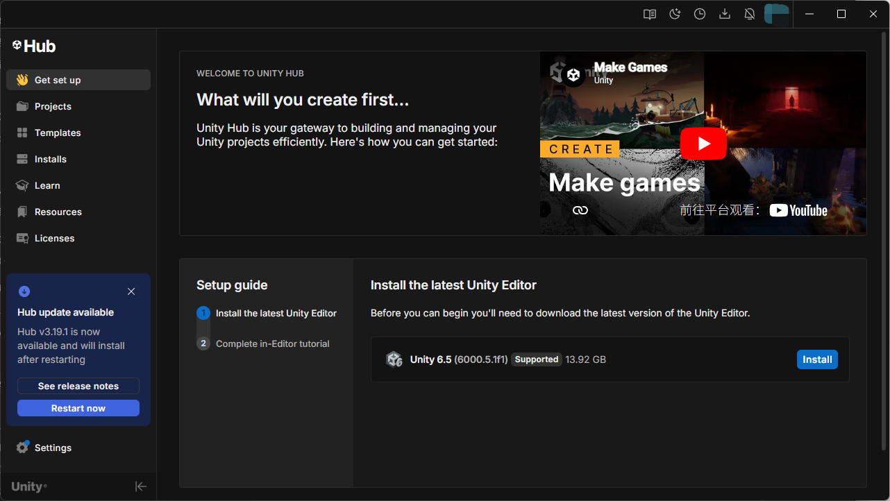

# Unity Hub 本地代理启动器

[English README](README.md)

一个轻量的 Windows 启动脚本，用于在启动 Unity Hub 时给当前进程注入代理相关环境变量。适合 Unity Hub 需要通过本地代理访问 Unity 服务，但你不想修改系统全局代理设置的场景。

## 功能

- 零依赖：只有一个 `.cmd` 文件。
- 为 Unity Hub 设置 `HTTP_PROXY`、`HTTPS_PROXY`、小写代理变量、`NO_PROXY` 和 `UNITY_NOPROXY`。
- 启动 Unity Hub 时传入 Chromium 的 `--proxy-server` 参数。
- 支持命令行参数和环境变量配置。
- 不会永久修改 Windows 环境变量或注册表。

## 背景：Unity 中国区服务变更

根据 Unity Support 公告，2026 年 6 月 30 日之后，注册地位于中国大陆、香港或澳门的组织将无法访问部分 Unity 全球 Gaming Services，包括部分 LiveOps、Multiplayer 和 Collaboration 服务。

如果你是中国区组织，Unity 官方建议迁移到对应的中国区服务。请先阅读 Unity 官方公告和 Unity China FAQ。

如果你的组织被错误标记为中国区，请按照 Unity 官方文档更新组织国家/地区和主要地址。

本项目只用于在已有代理环境下启动 Unity Hub，帮助处理 Unity Hub 网络连接问题。它不提供代理服务，也不能恢复因 Unity 地区政策、授权、付费、账号或访问控制机制而停止的服务访问。

建议按这个顺序处理：

1. 先阅读 Unity 官方公告，确认你遇到的是地区服务变更、组织地址问题，还是 Unity Hub 网络连接问题。
2. 如果组织被错误标记为中国区，先按 Unity 官方文档修正组织地址和国家/地区。
3. 如果只是 Unity Hub 无法正常加载首页、安装器或资源内容，并且你已经有可用的本地代理，再使用本项目启动 Unity Hub。
4. 如果你的服务确实受 2026 年 6 月 30 日后的中国区服务变更影响，请按 Unity 官方建议迁移到对应的中国区服务。

## 快速开始

下载或克隆本仓库，然后运行：

```bat
launch-unity-hub-proxy.cmd
```

默认配置为：

```text
代理地址：http://127.0.0.1:7890
Unity Hub：%ProgramFiles%\Unity Hub\Unity Hub.exe
```

## Unity Hub 加载示例

如果代理配置正确，Unity Hub 应该能正常加载首页、安装器或资源内容。



## 使用方式

指定代理地址：

```bat
launch-unity-hub-proxy.cmd http://127.0.0.1:10809
```

指定 Unity Hub 路径：

```bat
launch-unity-hub-proxy.cmd http://127.0.0.1:7890 "C:\Program Files\Unity Hub\Unity Hub.exe"
```

查看帮助：

```bat
launch-unity-hub-proxy.cmd --help
```

## 环境变量

你也可以不用命令行参数，改用环境变量配置：

```bat
set UNITY_HUB_PROXY=http://127.0.0.1:7890
set UNITY_HUB_PATH=C:\Program Files\Unity Hub\Unity Hub.exe
set UNITY_HUB_NO_PROXY=localhost,127.0.0.1,::1
launch-unity-hub-proxy.cmd
```

命令行参数优先级高于环境变量。

## 让 AI 帮你配置

如果你不确定应该填写哪个代理地址或 Unity Hub 路径，可以把本仓库链接或 README 内容发给 AI，并复制下面这段提示词：

```text
请帮我在 Windows 上使用 Unity Hub Proxy Launcher。
我的目标是通过本地代理启动 Unity Hub。
请一步一步问我需要的信息，比如 Unity Hub 安装路径、代理软件端口，然后给我最终要运行的命令。
不要修改系统全局代理，不要修改注册表，只使用这个项目里的 launch-unity-hub-proxy.cmd。
```

如果你的 AI 工具不能读取网页，请直接复制 README 内容给它。

## Unity 官方链接

- [Unity Services Access Ending June 30, 2026 — Information for China-Based Developers](https://support.unity.com/hc/en-us/articles/48560187308436-Unity-Services-Access-Ending-June-30-2026-Information-for-China-Based-Developers)
- [Unity China Cloud Services FAQ](https://www.unity.cn/cloud-service-faq)
- [How to update your organization's address or country](https://support.unity.com/hc/en-us/articles/46874716411028-How-to-update-your-organization-s-address-or-country)
- [Use Unity through web proxies](https://docs.unity3d.com/6000.6/Documentation/Manual/ent-proxy-autoconfig.html)

## 注意事项

- 代理只会作用于这个脚本启动的 Unity Hub 进程，以及继承它环境变量的子进程。
- 启动 Unity Hub 前，请先确认本地代理软件已经运行。
- 如果 Unity Hub 安装在非默认位置，请通过第二个参数传入路径，或设置 `UNITY_HUB_PATH`。
- 本项目不提供代理服务，也不能处理 Unity 地区政策、授权、付费、账号或访问控制机制导致的限制。

## 许可证

MIT License。详见 [LICENSE](LICENSE)。
